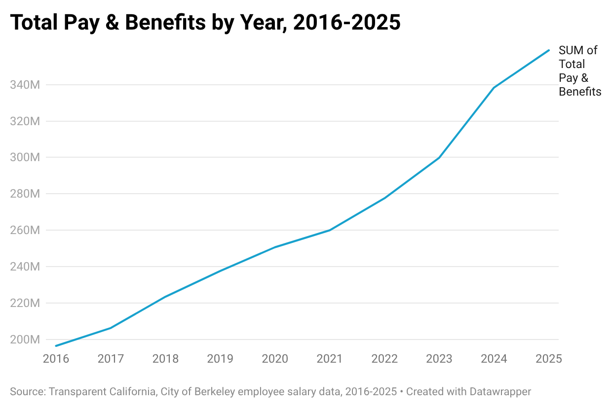
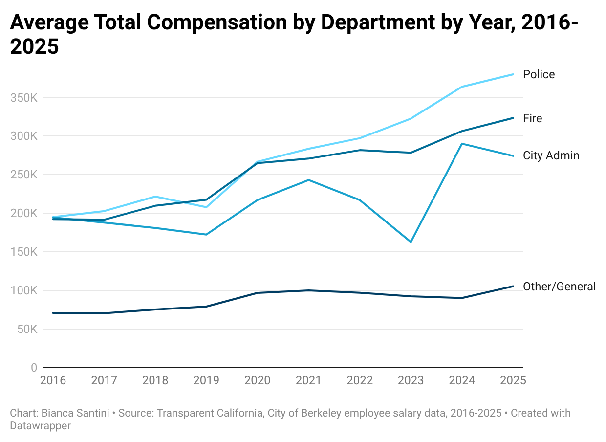

# Berkeley Police Pay Nearly Doubled Since 2016, Outpacing Growth Across Other City Departments

## Where the Data Came From
This project uses employee salary and benefits data for the City of Berkeley from 2016-2025, compiled from [Transparent California](https://transparentcalifornia.com/salaries/berkeley/), a nonprofit transparency project run by the Nevada Policy Research Institute. Transparent California obtains this data directly from California public agencies through the California Public Records Act (CPRA), then publishes it in a standardized format.
I initially checked the City of Berkeley's own open data portal, which hosts salary datasets sourced from Transparent California -- but only through 2014. The portal has not been updated with more recent salary data in over a decade, which is itself worth noting: it suggests the city's own transparency infrastructure has stalled even as this data continues to be publicly available elsewhere.
**Is this a trustworthy source?** Transparent California is not a neutral government body -- it's run by a free-market policy organization that publishes public employee compensation specifically to draw attention to public-sector pay. That doesn't mean the underlying number are inaccurate (they are sourced from CPRA requests, the same legal mechanism a journalist would use directly), but it does mean the framing and emphasis on their own site has a point of view. For this project, I used only the raw compensation figures, not any analysis or framing from transparent California itself.
** Data quality challenges:** Several years of this dataset (particularly 2016, 2017, and 2020) had formatting inconsisencies -- misaligned columns and a small number of duplicate header rows embedded as data -- that required manual cleaning before analysis. Nine row (0.04% of ~23,046 total records) had unresolvable missing job classification data and were excluded from department-level analysis.

## Data Analysis
I used Google Sheets to clean and analyze this data.The full sheet, including raw data and pivot tables, is available here: [Google Sheet link](https://docs.google.com/spreadsheets/d/1Eu1pWAMy9Q1T-vzmpYAgKBSPrJCoTKTivsCocZuw8oI/edit?usp=sharing).
**Cleaning** Before analysis, I identified and corrected columns misalignments affecting the 2016, 2017, and 2020 data (caused by an extra field in the original source rows for those years -- titled: "Pension Debt' -- which shifted subsequent column). I also removed duplicate header rows that had been inadvertently pasted in as data during the initial import, and added a "Department" column, derived from each employee's job title, to group individual roles into four broader categories: Police, Fire, City Admin, and Other/General.
**Pivot Table 1 -- Citywide Payroll trend:** I aggregated total compensation (Total Pay & Benefits) and employee headcount by year. This showed total citywide payroll grew from roughly $196 million in 2016 to $359 million in 2025 -- an increase of about 83% -- while headcount grew only about 16% over the same period (2,181 to 2,531 employees), indicating that per-employee cost, not staff growth, is the primary driver of rising payroll costs.

**Pivot Table 2 -- Department-level growth:** I averaged Total Pay & Benefits by department and year. Average compensation grew across all departments from 2016 to 2025, but at very different rates. Police pay grew the fastest, from about $195,000 to $380,000 -- an increase of roughly 95%. Fire followed at about $192,000 to $324,000, a 68% increase. City Admin and Other/General staff saw more modest growth, at roughly 41% and 49% respectively. While every department saw real gains, the compensation gap between public safety departments (Police and Fire) and other city staff widened substantially over this period.

**Pivot Table 3 -- Overtime trend:** I summed and averaged Overtime Pay by year. Average overtime pay per employee, citywide, rose from about $4,740 in 2016 to $9,021 in 2025 -- a 90% increase -- while total citywide overtime spending grew from $10.3 million to $22.8 million, a 121% increase. Overtime cost grew faster than total compensation overall (83%) over the same period, suggesting overtime is an increasingly significant driver of payroll growth rather than a stable, predictable cost.

## Methods and Limitations
**Data cleaning:** The 2016, 2017, and 2020 source data contained an extra field ("Pension Debt") not present in other years, which shifted subsequent columns out of alignment when originally compiled. I identified this by cross-checking row structure against clean years and corrected it manually. I also found and removed duplicate header rows that had been inadvertently included as data rows during the initial CSV imports. Nine rows (0.04% of ~23,046 total records) had unresolvable missing job classification data and were excluded from department-level analysis; this exclusion has a negligible effect on the findings given its small size.
**Department categorization:** The "Police," "Fire," "City Admin," and "Other/General" groupings used in this analysis are my own categorization based on keyword matching against job titles, not an official city organizational structure. Job titles that didn't clearly match Police, Fire, or a small set of City Admin roles (City Manager, City Attorney, City Clerk) were grouped into "Other/General," a broad category that includes everything from senior professional staff to part-time and seasonal youth program employees. This means "Other/General" averages may understate compensation growth for full-time, non-public-safety professional staff specifically, since seasonal and part-time roles are mixed in.
**Small-department volatility:** City Admin, a smaller department than Police or Fire, shows more volatile year-to-year averages (for example, a dip in 2023 followed by a sharp rise in 2024). With fewer employees, individual personnel changes -- such as a high earner leaving or joining -- can swing the department's average compensation more dramatically than in larger departments. This volatility reflects the small sample size within that category, not necessarily a meaningful policy or staffing trend.
**Headcount vs. per-employee cost:** Total payroll growth (83% from 2016-2025) significantly outpaced headcount growth (16%), indicating that rising per-employee compensation, not staffing increases, is the primary driver of total payroll growth. This analysis does not break down how much of that per-employee growth is attributable to base pay increases, benefit costs (e.g., pension contributions), or promotions into higher-paid roles -- a more detailed analysis by pay category would be needed to fully explain the mechanism.
**Part-time and seasonal employees:** The dataset includes both full-time and part-time/seasonal employees (identified in the Status column) without distinguishing between them in this analysis. Including seasonal youth program staff and reserve officers, who may earn only a few thousand dollars annually, alongside full-time career employees affects department-wide averages, particularly for Other/General and, to a lesser extent, Police.

## Final Summary
This analysis of Berkeley city employee compensation from 2016 to 2025 found that total citywide payroll grew 83%, far outpacing 16% headcount growth -- meaning rising per-employee cost, not staffing increases, is driving payroll growth. That growth was uneven: Police compensation nearly doubled (95%) and Fire grew 68%, while City Admin and Other/General staff saw more modest gains (41% and 49%). Overtime pay grew even faster than overall compensation, suggesting it's an increasingly significant cost driver, particularly within Police and Fire.
**Ethical concerns:** This data includes real people's compensation, tied to their names and job titles. While this is legally public information obtained through the same CPRA process any journalist could use, publishing individual salary figures -- especially for lower-paid seasonal or part-time employees -- carries some risk of exposing people who aren't part of the actual story here, which is about departmental and systemic trends, not individual employees. I focused this analysis on aggregate department-level and citywide patterns rather than singling out individuals, and I'd recommend any follow-up reporting do the same unless a specific individual's compensation becomes independently newsworthy (e.g, tied to a specific decision or controversy).
There's also a risk of this data being used to stigmatize public safety workers broadly without context -- rising Police and Fire compensation may reflect legitimate factors like staffing shortage requiring overtime, negotiated union contracts, or regional wage competition, not necessarily mismanagement. This analysis identifies a pattern; it does not establish a cause.
**What additional reporting would be needed:** To turn this into a complete, responsible story, I would need to: (1) review Berkeley's police and fire union contracts to understand what's contractually driving overtime and base pay increases; (2) interview city HR or finance officials about staffing levels and budget decisions; (3) compare Berkeley's compensation growth to peer Bay Area cities to determine whether this reflects a regional trend or a Berkeley-specific pattern; and (4) speak with current employees, particulary in Other/General roles, about how they experience this widening compensation gap.
